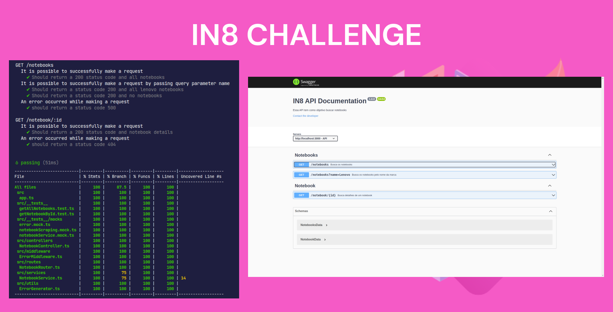
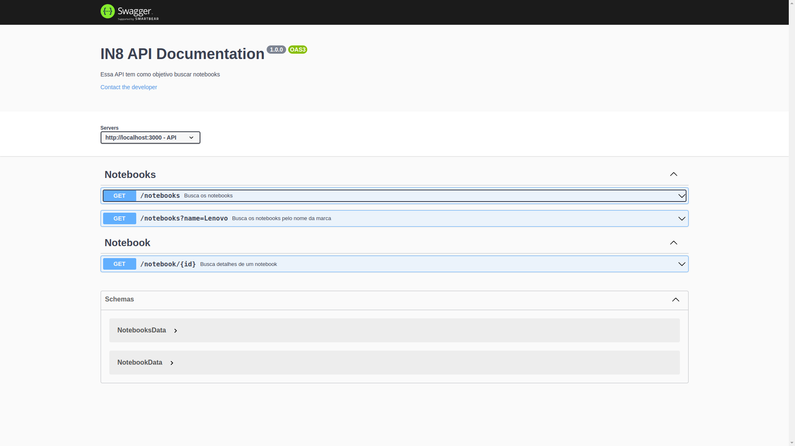
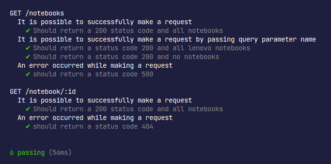
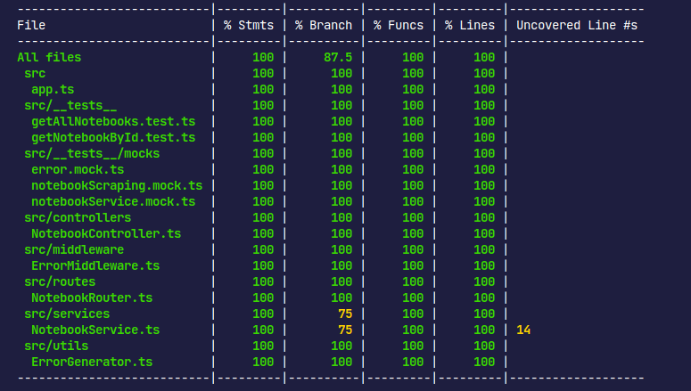

```

```

<h1 align="center">
    
    <br>
</h1>
<h4 align="center">
  Este é um desafio técnico realizado para a IN8 com o intuito de ocupar a vaga de desenvolvedor backend.
</h4>

## 🚀 Tecnologias

Esse projeto foi desenvolvido com as seguintes tecnologias:

- Express
- Puppeteer
- TypeScript
- Docker
- Swagger-UI
- Mocha
- Chai
- Prettier
- ESLint

## 🛠️ Como instalar

**#Clonar este repositório**

```
git clone https://github.com/edersonlucas/in8-challenge
```

**#Entre na pasta do projeto**

```
cd in8-challenge
```

**#Renomeie o arquivo ".env.example" que está na pasta raiz do projeto para ".env"**

### 🐋 Rodando com Docker

⚠️ **Atenção**: Você precisa ter o docker e o docker-compose instalados em sua máquina para rodar o projeto.

**#Rode o seguinte comando para subir o container (Pode demorar alguns minutos ☕)**[](https://emojipedia.org/pt/café/)

    docker compose up

**#Para executar os testes de cobertura do backend, use os seguintes comandos:**

```

docker exec -it backend /bin/sh
npm run test:coverage

```
### ‍💻 Rodando sem Docker

⚠️ **Atenção**: Você precisa ter o node instalado em sua máquina para rodar o projeto.

**#Primeiro você deve instalar as dependências do projeto, para isso rode**

```
npm install
```
**#Rode o seguinte comando para executar a aplicação**

```
npm run dev
```
**#Para executar os testes de cobertura do backend, use os seguintes comandos:**

```
npm run test:coverage

```

### ⚠️ Documentação das rotas

**#Você pode abrir a documentação da API em:**

Documentação: http://localhost:3000/api-docs





#### [🚨](https://emojiterra.com/pt/luz-giratoria/) Em caso de dúvida, entre em contato..

[Email](edersonlucas@outlook.com.br)

[Linkedin](https://www.linkedin.com/in/edersonlucas/)

---

Desenvolvido por: [Ederson Lucas](https://www.linkedin.com/in/edersonlucas/)